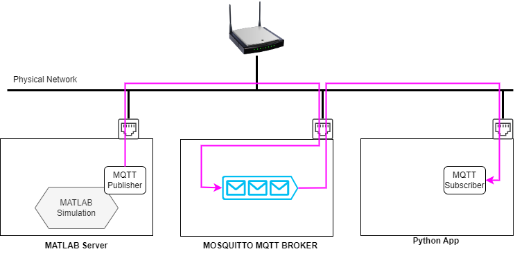
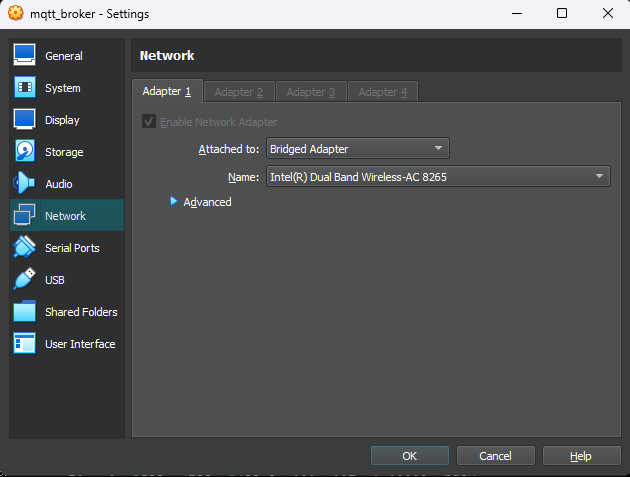
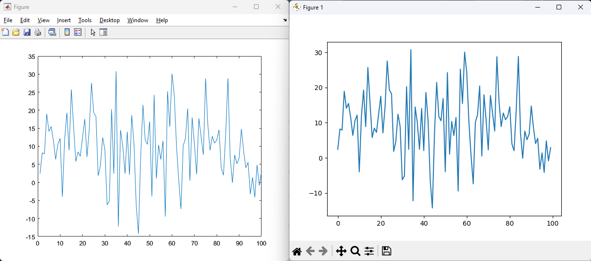

<center> <h1>Interfacing MATLAB Simulation with Python through MQTT Transport </h1> </center>
<center><h6>Saptarshi Ghosh</h6></center>
<hr>

# Introduction
MATLAB Simulation is a common practice in engineering prototyping. However, interfacing it with a general-purpose programming language like Python over a low-latency protocol like MQTT undoubtedly provides an edge. External applications or hardware may consume simulation data from MATLAB through Python-based APIs to behave as a Digital Twin.  

In this experiment, I have put a boilerplate for cross-platform developers to integrate MATLAB and Python over MQTT. 

# Lab Setup

<br>
Setting up the environment requires the following:
1. __MATLAB Server__: A PC running MATLAB with _Industrial Communication Toolbox_ installed. 
2. __MQTT Broker__: A Ubuntu 22.04 server VM with _Mosquitto_ MQTT broker installed. 
3. __MQTT Subscriber__: A Python App acting as a MQTT subscriber using _Paho_ library. 
4. A LAN network for physical communication. 

## Preparing the Broker VM
Several options for an MQTT broker include cloud-based, on-host, remote, etc. However, I chose to isolate the broker runtime using a Ubuntu 22.04 server VM. A docker container would also do the same.

Ensure the Virtual Network adapter attached to the VM is on the same network as the other systems. In my case, I have bridged the VM's vNIC to my Wi-Fi network. 


<br>
### Installing Mosquitto and configuring the broker  for remote access
Installing _Mosquitto_ is simple, just run the following commands 
```bash
sudo apt-add-repository ppa:mosquitto-dev/mosquitto-ppa
sudo apt-get update
sudo apt-get install mosquitto
sudo apt-get install mosquitto-clients
```

By default the broker allows only local connection to come through. To allow remote access to the broker, follow the steps below. 
1. Create a password file at `/etc/mosquitto/` directory named `pw_file.conf`.
    ```bash
    sudo nano /etc/mosquitto/pw_file.conf
    ```
2. Define listener port (1883) and allow unauthorised access.
    ```bash
    listener 1883
    allow_anonymous true
    ```
3. Restart Mosquitto service 
    ```bash 
    sudo systemctl stop mosquitto
    sudo systemctl start mosquitto
    ```

### Starting the Broker
Now start the broker in verbose mode (`-v`) specifying the path of the config file (`-c`)
```bash
mosquitto -v -c /etc/mosquitto/pw_file.conf
```
Should show the follwoing output:
```bash
1704211444: mosquitto version 2.0.11 starting
1704211444: Config loaded from /etc/mosquitto/pw_file.conf.
1704211444: Opening ipv4 listen socket on port 1883.
1704211444: Opening ipv6 listen socket on port 1883.
1704211444: mosquitto version 2.0.11 running
```
Now the Broker is ready and listening to port 1833. 

## Writing a Subscriber App in Python 
### Dependencies 
The `subscribe.py` file has the following dependencies. 
```
Package         Version
--------------- -------
contourpy       1.2.0
cycler          0.12.1
fonttools       4.47.0
kiwisolver      1.4.5
matplotlib      3.8.2
numpy           1.26.2
packaging       23.2
paho-mqtt       1.6.1
pillow          10.2.0
pip             23.2.1
pyparsing       3.1.1
python-dateutil 2.8.2
setuptools      65.5.0
six             1.16.0
```
### Subscriber script
The Subscriber App uses the `Paho` library, refer to the source code below.
```python
import paho.mqtt.client as mqtt
import time

# global config variables 
BROKER_IP = '192.168.1.74'  # IP of the broker 
BROKER_PORT = 1883          # Port number 
SUBSCRIBER_ID = 'sub1'      # unique ID for the subscriber
TOPIC='test/matlab'         # topic to subscribe 
SUB_INTERVAL = 1            # polling interval 
DATA_BANK='databank.dat'    # file to bank data 


def on_message(client, userdata, message):
    """
    invoked when a message is received at the subscriber
    """
    data=str(message.payload.decode("utf-8"))
    print(f'Received: {data}')

    # Data banking 
    with open(DATA_BANK,'a') as fp:
        fp.write(data+'\n')

try:
    subscriber = mqtt.Client(client_id=SUBSCRIBER_ID)    # create a client object 
    subscriber.connect(host=BROKER_IP, port=BROKER_PORT) # connect to the broker
    
    print('------------ Subscriber Ready --------------')
    
    subscriber.subscribe(topic=TOPIC) # subscribe to a topic
    subscriber.on_message=on_message  # points to on_message() function
    time.sleep(SUB_INTERVAL)          # wait 
    subscriber.loop_forever()         # repeat forever 

except KeyboardInterrupt:
    print('Subscription terminated by user')

except Exception as e:
    print(str(e))

```

## Writing a Publisher in MATLAB

MATLAB 2021a onwards requires the _Industrial Communication Toolbox_ to run MQTT. Make sure to install it first. 

### Organising all global config variables 
```matlab
%% Global variables
BROKER_IP='192.168.1.74'; % IP of the Mosquitto broker
BROKER_PORT=1883;         % default port 
CLIENT_ID="matlabclient"; % client ID
KEEP_ALIVE=60;            % Keepalive timer
PROTO="tcp";              % Transport Protocol
TOPIC="test/matlab";      % topic 
```
### Creating a MQTT Client instance

The `mqttclient` function takes similar arguments as the `Paho` in Python, just the Broker's hostname in MATLAB requires the transport protocol to be specified i.e., `tcp://HOSTNAME` or `ssl://HOSTNAME`. 
```matlab
client=mqttclient(PROTO+"://"+BROKER_IP, ...
                  "Port",BROKER_PORT, ...
                  "ClientID",CLIENT_ID, ...
                  "KeepAliveDuration",KEEP_ALIVE);
```
### Publishing random data
The following code publishes random samples from $X \sim\mathcal{U}[10,20]$ for 100 iterations with an interval of 10ms. 
```matlab
ITERATION=100;   % number of samples 
INTERVAL=0.01;   % interval between samples 
LOW=10;          % lower bound 
HIGH=20;         % upper bound 
Rand_Nums=LOW + (HIGH-LOW)*randn(1,ITERATION); % rand Vector
for i = 1:ITERATION
    rand_num=Rand_Nums(i)
    message=num2str(rand_num)
    write(client,TOPIC,message);
    pause(INTERVAL);
end
```
# Verify 
Let's first run the Broker, Subscriber and Publisher to capture data. 
1. Run the broker
    ```bash 
    mosquitto -v -c /etc/mosquitto/pw_file.conf
    ```
2. Run the Subscriber 
    ```powershell
    .\venv\Script\activate
    python subscribe.py
    ```
3. Run the Publisher in Matlab 

In a parallel terminal at the Broker VM capture the full-sized packets (`-s`) of TCP port 1883 from the interface (`-i`) _enp0s3_ using _tcpdump_ and store them in a Wireshark compatible format (`-w`) as _mqtt_traffic.pcap_ file. 
```bash
sudo tcpdump -i enp0s3 tcp port 1883 -s 65535 -w  mqtt_traffic.pcap
```

Once captured this file can be opened in Wireshark for further analysis. For example, analysing traffic patterns for filtered MQTT packets. 

Finally, to verify the sample patterns as generated and published by MATLAB and stored by the subscriber, a simple plotting script (given below) confirms the match. 

```python
import matplotlib.pyplot as plt

def read_file_to_list(filename:str)->list:
    """Reads a text file with line-seperated data and returns a list assembling them

    Args:
        filename (str): name of the file

    Returns:
        list: list of data (read top down) 
    """
    with open(filename, 'r') as fp:
        data_list=fp.readlines()
    return [float(i) for i in data_list] # convert items into float and return

def main():
    FILE_NAME='databank.dat'
    plt.plot(read_file_to_list(filename=FILE_NAME))
    plt.show()

if __name__ =='__main__':
    main()
```

<br>
# Conclution
Cross-platform integration of simulation is highly beneficial as it allows taking advantage of the best of both platforms. However, the MQTT package in MATLAB is compatible with C-level code generation through Simulink. To use MQTT in Simulink a _Hardware-in-the-Loop_ option must be used. 


